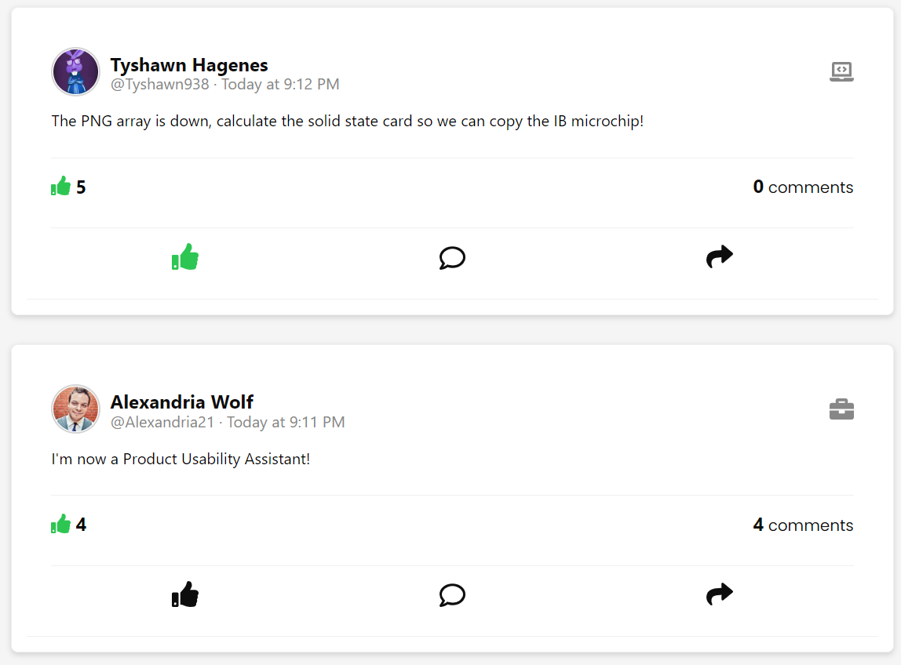
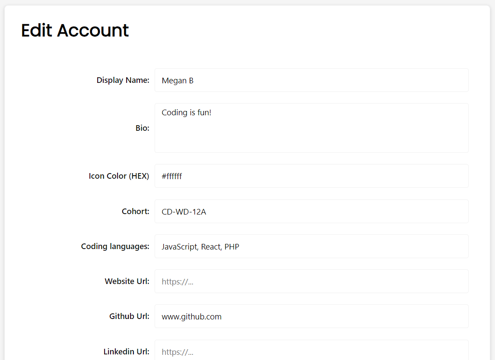

  

# Full Stack Hub - Social Media Site
 
## Table of Contents
* [Introduction](#introduction)
* [Dependencies](#dependencies)
* [Demo](#demo)
* [Deployment](#deployment)
* [Credits](#credits)

## Introduction 
 Full Stack Hub is a social media site for developers. This application was built with React.js, Node.js, Express.js, and Firebase. This project has functioning Firebase login authentication and data/image storage. Users can create an account, create posts with photos/links/captions, like/comment on posts, follow users, edit their profile, and search for users. Posts are sorted into 3 categories: Career, Project, and Personal. 

## Dependencies
To run the app, install required dependencies using `yarn install` in the /client and the /server folders.

## Demo

  
  
  
  
  
  
  

## Deployment
  Code is visible on Github.
   * [Github repo](https://github.com/megan-barnard/full-stack-hub.git)

## Credits
Created by [Megan Barnard](https://github.com/megan-barnard). This project was completed as a final project for Concordia University Full Stack Web Development Bootcamp.
